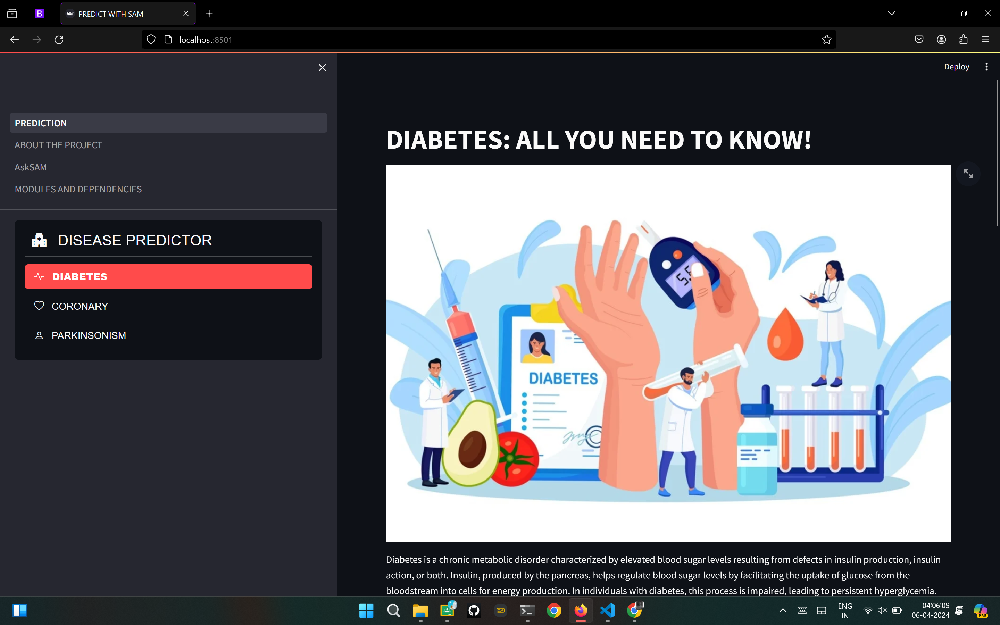
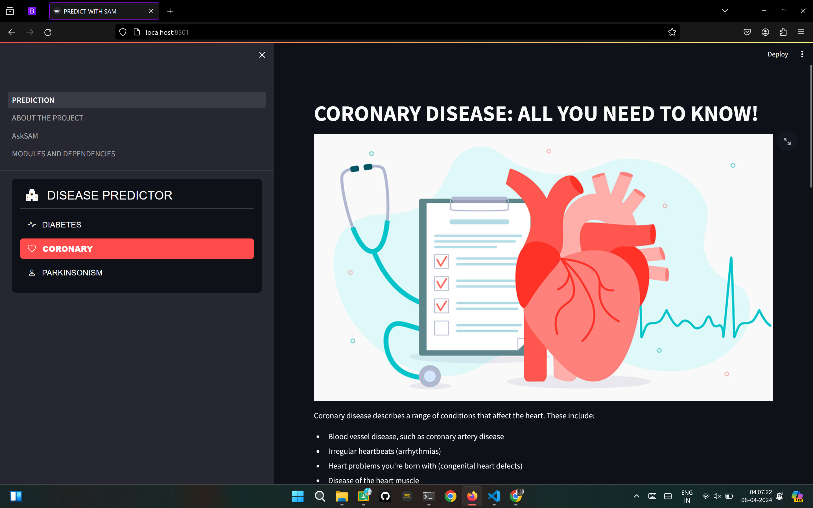
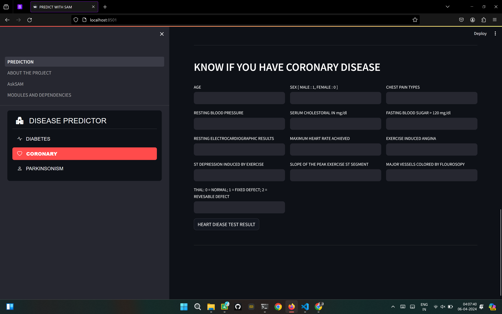
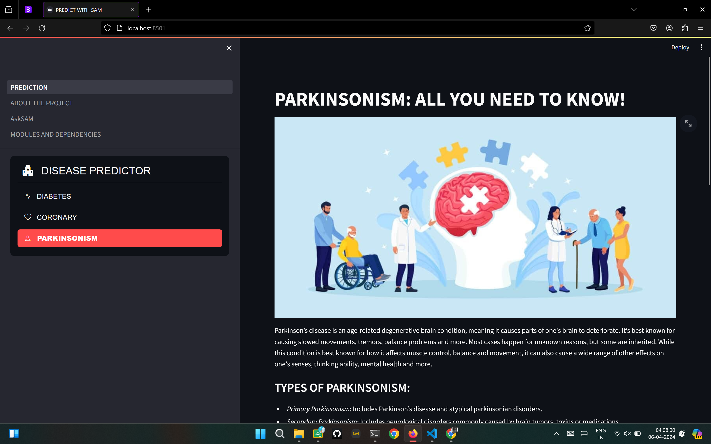
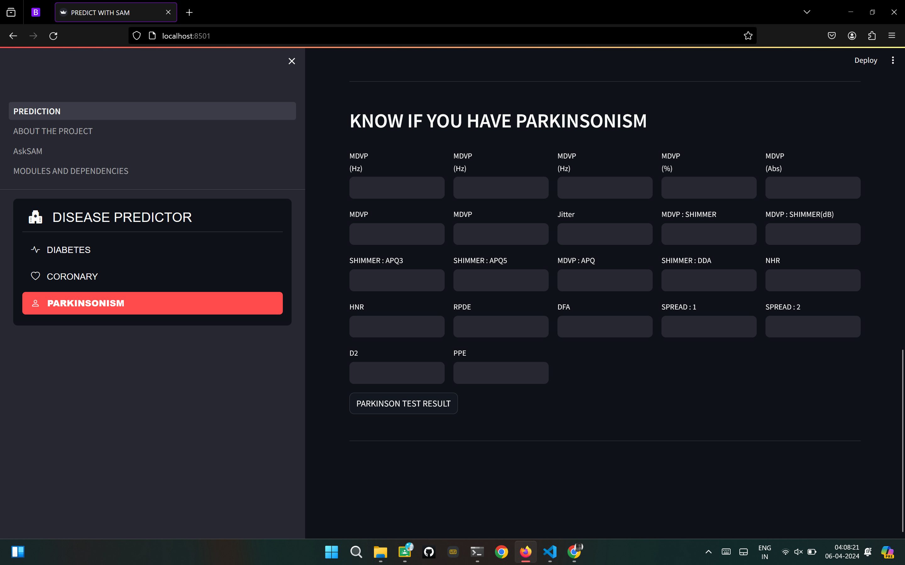
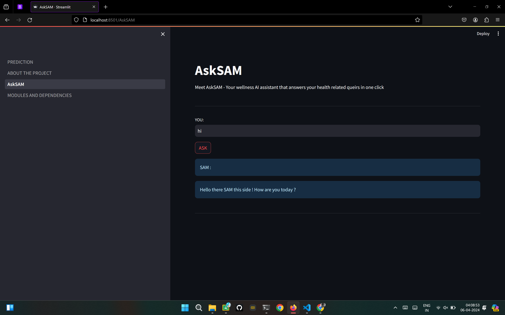
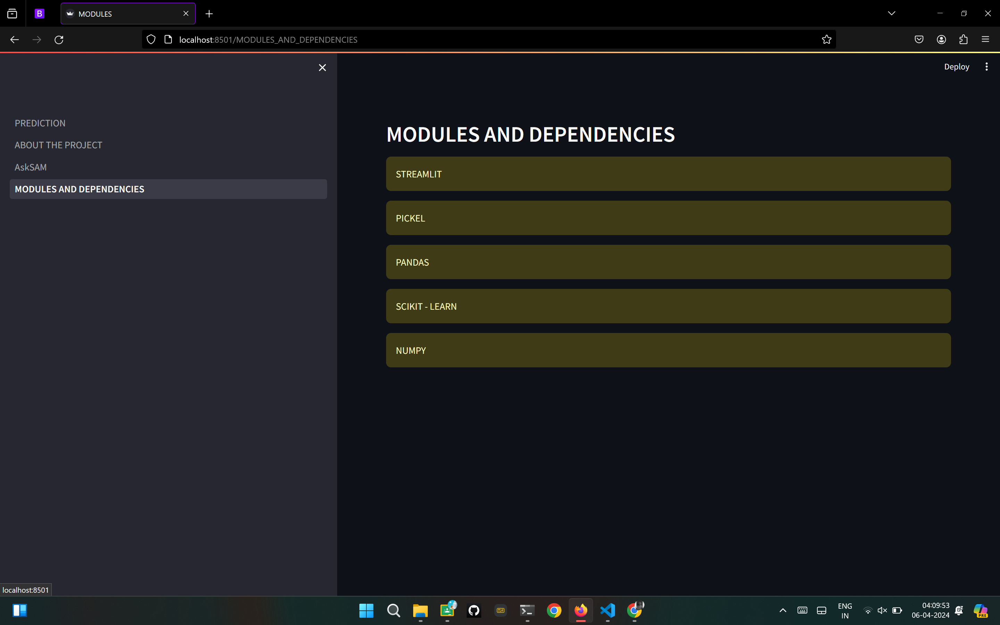

# PREDICT WITH SAM 
## A machine learning disease-predictor model

*A machine learning disease prediction model integrated with a health chatbot serves as an innovative tool for proactive healthcare management. Leveraging sophisticated algorithms, this model analyzes patient data to predict the likelihood of various diseases with high accuracy. Simultaneously, the chatbot component offers a platform for users to freely discuss health-related concerns, symptoms, and queries. By combining predictive analytics with conversational interfaces, the system empowers individuals to make informed decisions about their health and seek timely medical assistance. Furthermore, the chatbot's accessibility fosters a supportive environment for users to engage in open dialogue, promoting proactive health monitoring and preventive care.*

## DEPENDENCIES AND STEPS FOR RUNNING THIS PROJECT
```bash
pip install virtualenv
```

```bash
virtual env
```

```bash
cd env
```

```bash
.env\Scripts\activate
```

```bash
pip install streamlit 
pip install numpy
pip install pandas
pip install scikit-learn
pip install pickel
```

```bash
git clone git@github.com:SUVAJITKARMAKAR/predict-with-SAM.git
```

```bash
streamlit run PREDICTION.py
```

## ABOUT THE MODULES AND DEPENDENCIES
#### STREAMLIT
*Streamlit is an open-source Python library used for building interactive web applications with minimal effort. With Streamlit, developers can create intuitive and visually appealing interfaces for data exploration, machine learning models, and more, directly from Python scripts. The library simplifies the process by automatically handling tasks like layout design, widget creation, and reactive updates. Streamlit's intuitive API allows users to quickly prototype ideas and share insights with others. It's widely appreciated for its simplicity, flexibility, and seamless integration with popular data science libraries like Pandas, Matplotlib and TensorFlow.*

#### NUMPY
*NumPy is a powerful Python library for numerical computing, offering support for arrays, matrices, and mathematical functions. It provides efficient data structures for handling large datasets and performing operations such as sorting, reshaping, and statistical analysis. NumPy's array operations are optimized for speed, making it a cornerstone for scientific computing and data analysis tasks. Its seamless integration with other Python libraries like SciPy and Matplotlib enhances its versatility for various applications including machine learning, image processing, and computational physics. Overall, NumPy serves as a fundamental tool for high-performance computation and data manipulation in Python programming.*

#### PANDAS
*Pandas is a powerful Python library designed for data manipulation and analysis. It provides easy-to-use data structures and functions, primarily DataFrame, which resembles a spreadsheet with rows and columns. Pandas allows for efficient handling of large datasets, offering functionalities for data cleaning, exploration, transformation, and visualization. It seamlessly integrates with other libraries like NumPy and Matplotlib, making it a cornerstone tool for data scientists and analysts. With its intuitive syntax and comprehensive documentation, Pandas simplifies complex data tasks, enabling users to extract valuable insights and drive informed decisions in various domains, including finance, research, and machine learning.*

#### PICKEL
*The Python module pickle provides functionality for serializing and deserializing Python objects. It enables easy conversion of complex data structures into a byte stream, which can be stored or transmitted efficiently.Pickle facilitates object persistence, allowing objects to be saved to disk and loaded back into memory effortlessly.*

#### SCIKIT-LEARN
*Scikit-learn is a powerful Python module for machine learning. It offers a wide range of algorithms for tasks like classification, regression, clustering, and dimensionality reduction. With user-friendly interfaces and extensive documentation, scikit-learn simplifies the process of building and deploying machine learning models for both beginners and experts.*

## BADGES

[](https://choosealicense.com/licenses/mit/)

[](https://opensource.org/licenses/)

[](http://www.gnu.org/licenses/agpl-3.0)


## FEATURES

- Quick prediction of the disease.
- AI assistant chatbot ~ SAM to solve all health-related queries.
- Fully scalable.
- Light weight and fast.
- High success rates for proper detection of the diseases.


## SCREENSHOTS










## AUTHORS

- [@SUVAJITKARMAKAR](https://github.com/SUVAJITKARMAKAR)
- [@ALWINTOMY](https://github.com/ALW-N)
- [@MANOSWITABOSE](https://github.com/manoswita2501)
